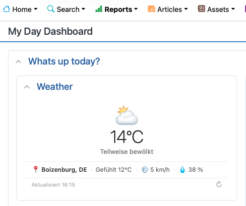

# RT-Extension-WeatherWidget

> **Live weather, right where your team starts the day — personalised per user, zero configuration overhead.**

Your RT dashboard is the first thing your team sees every morning. With **RT-Extension-WeatherWidget**, every user gets an instant glance at the weather for *their* location — pulled automatically from the City / Zip / Country fields already stored in their RT profile. No browser permission prompts. No per-user setup. No API keys to manage. Just open your dashboard and the weather is there.

---



*The Weather widget blends seamlessly into any RT 6 dashboard — clean, compact, and always in the right language.*

---

## Why This Widget Exists

RT is a powerful platform, but out of the box its dashboards are purely functional. **WeatherWidget** is part of a broader effort to make RT a place people *enjoy* working in — not just a queue manager, but a thoughtful workspace. Knowing the weather at a glance helps teams plan field visits, prepare for commutes, and simply feel that their tools care about them as people.

---

## Features

- **Profile-driven location** — reads City, Zip and Country directly from the logged-in RT user's profile; every team member automatically sees their own local weather
- **No API key required** — weather data comes from [Open-Meteo](https://open-meteo.com) (free, EU-hosted, GDPR-friendly); geocoding via [Nominatim / OpenStreetMap](https://nominatim.org)
- **Rich condition display** — 25 WMO weather codes mapped to labels and emoji icons
- **Fully localised** — widget title adapts to the user's RT language setting (DE, EN, FR, ES, IT, NL, PT, RU, JA, ZH, PL, SV and more)
- **Theme-aware** — adapts to RT's light, dark and custom themes (Elevator, KN, Terminal) using Bootstrap CSS variables
- **30-minute cache** — results are stored in `sessionStorage`; navigating between RT pages does not trigger redundant API calls
- **Manual refresh** — a ↻ button lets users force an immediate update
- **Friendly empty state** — if a user has no location in their profile, the widget shows a direct link to their preferences page instead of a blank or broken card
- **HTMX-safe** — fully compatible with RT 6's HTMX page navigation

---

## How It Works

```
RT User Profile (City / Zip / Country)
        │  Mason reads at render time
        ▼
JavaScript receives location as variables
        │
        ├─▶ Nominatim API  →  lat / lon
        │
        └─▶ Open-Meteo API →  current weather
                │
                ▼
        Widget renders with emoji + temperature + condition
        Compact info row: location · feels like · wind · humidity
        Result cached 30 min in sessionStorage
```

No geolocation permission prompt. No server-side HTTP calls. The browser fetches weather data directly from public APIs using coordinates derived from the user's RT profile.

---

## Requirements

| Component | Requirement |
|---|---|
| Request Tracker | 5.0.0 – 6.x |
| Perl | 5.10+ |
| RT user profiles | City and/or Zip + Country must be filled in |
| Browser | Modern browser with Fetch API |
| Network | Browser needs outbound HTTPS to `api.open-meteo.com`, `geocoding-api.open-meteo.com`, `nominatim.openstreetmap.org` |

---

## Installation

### 1. Get the source

```bash
git clone https://github.com/yourname/RT-Extension-WeatherWidget.git
cd RT-Extension-WeatherWidget
```

### 2. Build and install

```bash
perl Makefile.PL
make
sudo make install
```

> Installs into `/opt/rt6/local/plugins/RT-Extension-WeatherWidget/`.

### 3. Register the plugin

Add to `/opt/rt6/etc/RT_SiteConfig.pm`:

```perl
Plugin('RT::Extension::WeatherWidget');
```

### 4. Allow the widget component

```perl
Set($HomepageComponents, [qw(
    WeatherWidget ClockWidget
    QuickCreate QueueList MyReminders Dashboards
    # ... your existing components
)]);
```

### 5. Optional: configure temperature unit

```perl
Set(%WeatherWidgetOptions,
    TemperatureUnit => 'celsius',   # or 'fahrenheit'
);
```

### 6. Clear Mason cache and restart

```bash
sudo systemctl stop apache2
sudo rm -rf /opt/rt6/var/mason_data/obj/*
sudo systemctl start apache2
```

---

## User Setup

Each user needs **City** and/or **Zip** and **Country** filled in their RT profile:

**Admin path:** Admin → Users → *[select user]* → General tab  
**Self-service path:** Preferences → About Me

The widget reads these fields at page render time — no further action needed.

If a user has no location data, the widget displays a friendly message with a direct link to their preferences page.

---

## Usage

1. Open a dashboard and click **Edit**
2. Find **Weather** (or the localised title) in the available portlets list
3. Drag into any column and **Save**

---

## Localisation

The widget title is automatically displayed in the language the user has selected in their RT preferences. Bundled translations:

| Language | Title |
|---|---|
| English | Weather |
| Deutsch | Wetter |
| Français | Météo |
| Español | Tiempo |
| Italiano | Meteo |
| Nederlands | Weer |
| Português | Tempo |
| Русский | Погода |
| 日本語 | 天気 |
| 中文 | 天气 |
| Polski | Pogoda |
| Svenska | Väder |

Additional languages can be added by placing a `.po` file in the `po/` directory.

---

## Theme Support

The widget adapts automatically to all standard RT 6 themes:

| Theme | Light | Dark |
|---|---|---|
| **Elevator** | White card, Bootstrap defaults | Dark navy card |
| **KN** | White card, navy accent | Deep navy card `rgba(0,34,68,0.95)` |
| **Terminal** | Muted green card `#edf5e8` | Near-black `#0a1a0a`, phosphor green text |

---

## Weather Conditions

| Condition | Example codes |
|---|---|
| ☀️ Sunny / Clear | 0, 1 |
| ⛅ Partly cloudy | 2 |
| ☁️ Overcast | 3 |
| 🌫️ Fog | 45, 48 |
| 🌧️ Rain / Drizzle | 51–67 |
| ❄️ Snow | 71–77 |
| 🌦️ Showers | 80–86 |
| ⛈️ Thunderstorm | 95–99 |
| 🌙 Clear night | 0 (is_day=0) |

---

## File Structure

```
RT-Extension-WeatherWidget/
├── Makefile.PL                          # Module::Install::RTx build script
├── Changes                              # Changelog
├── README.md                            # This file
├── screenshot.png                       # Dashboard screenshot
├── MANIFEST.SKIP                        # Exclusion list for make dist
├── po/                                  # Localisation files
│   ├── en.po  de.po  fr.po  es.po
│   ├── it.po  nl.po  pt_BR.po  ru.po
│   ├── ja.po  zh_CN.po  pl.po  sv.po
├── etc/
│   └── WeatherWidget_Config.pm.sample   # Sample RT_SiteConfig snippet
├── lib/
│   └── RT/
│       └── Extension/
│           └── WeatherWidget.pm         # Perl module (version, POD)
└── html/
    └── Elements/
        └── WeatherWidget                # Mason component (HTML + CSS + JS)
```

---

## APIs Used

| API | Purpose | Cost | Privacy |
|---|---|---|---|
| [Open-Meteo](https://open-meteo.com) | Weather data | Free, no key | EU-hosted, no tracking |
| [Nominatim](https://nominatim.org) | City → lat/lon | Free | OpenStreetMap data |

Both APIs are called from the **user's browser**, not from the RT server. No data leaves the user's browser to any third party beyond these two geocoding/weather APIs.

---

## Changelog

See [Changes](Changes).

---

## License

GNU General Public License v2 —
[https://www.gnu.org/licenses/old-licenses/gpl-2.0.html](https://www.gnu.org/licenses/old-licenses/gpl-2.0.html)

---

## Author

Torsten Brumm
